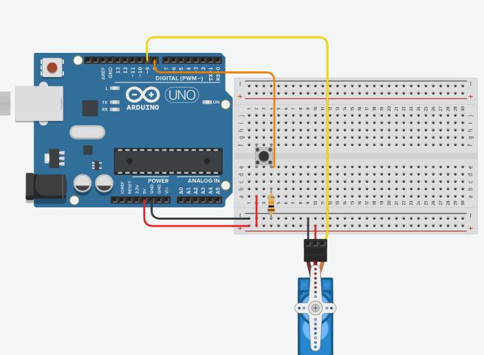
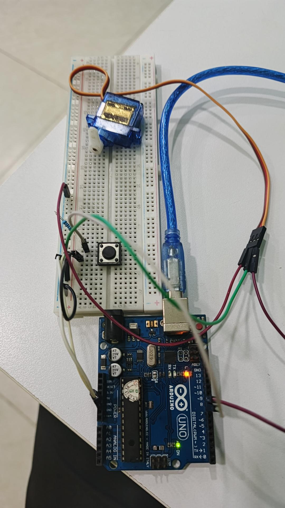

##SIMPLE SERVO CONTROLLER

##DETAILS:
- This project uses Arduino Uno with PWM signal to control the SG90 Servo.
- A pushbutton with a pull-down resistor is used to toggle the logic state and enable the controller.

##HARDWARE:
- Arduino Uno
- Jumper wires
- Breadboard
- Pushbutton
- 10kΩ Resistor
- Servo SG90
- 5V DC Power Source

##DIAGRAMS:

##REAL-LIFE CIRCUIT:

##Instructions:
1. Assemble the circuit.
2. Open the .ino file in Arduino IDE.
3. Select Board & COM Port.
4. Upload the code.
5. Press the button to activate/enable the servo.
